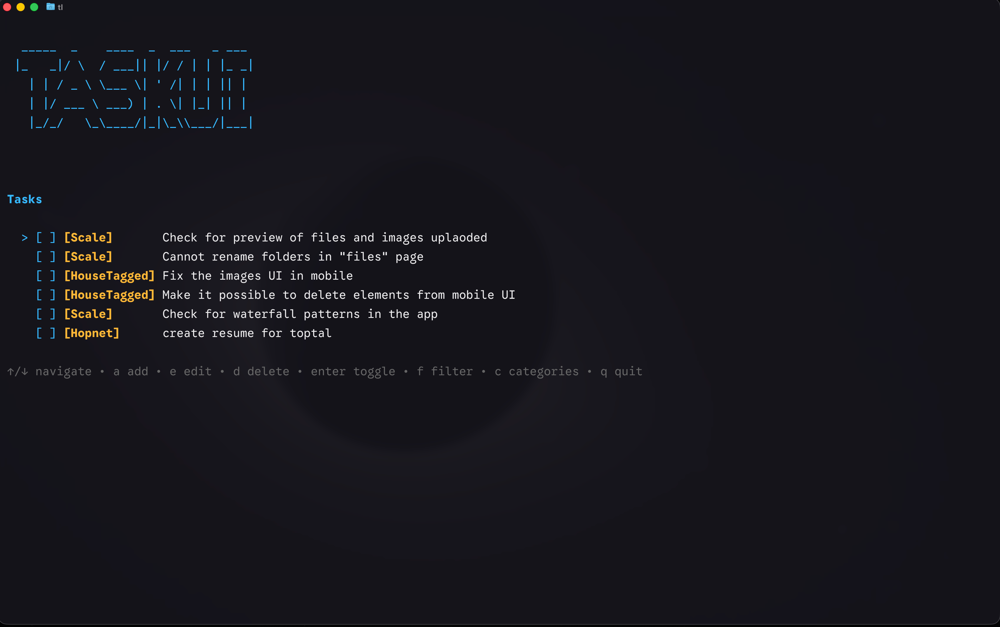

# TaskUI

A fast, keyboard-first terminal task manager built with Go, Bubble Tea, and SQLite - plus `tl`, a headless CLI for the same task database.

<p align="center">
  
</p>

## What it does

TaskUI helps you manage personal tasks directly from the terminal with a clean TUI experience. You can organize tasks by category, project, due date and priority, quickly capture new items in natural language, filter what you see, and keep everything stored locally in SQLite. The same database is also reachable headlessly via the `tl` command, so you can add or list tasks from a script or shell alias without opening the TUI.

## Features

- **Terminal-first workflow** with a polished Bubble Tea interface
- **Persistent storage** using SQLite
- **Natural-language quick capture** - type `pay rent tomorrow 5pm #finance !high` and it just works
- **Recurring tasks** - `standup every weekday`, `rent last day of month`; completing one spawns the next
- **Due dates and priority** with an overdue indicator in the task list
- **Agenda view** grouping everything into Overdue / Today / Tomorrow / This week / Later
- **Task categories** to group related work
- **Project scoping** - tasks are automatically filed against the project you launched from
- **Saved views** - four built-ins on `1`-`4`, plus any you save yourself
- **Command palette** (`ctrl+k`) over every action available right now
- **Add, edit, delete, and toggle completion** for tasks
- **Filter tasks** to focus on a specific category or subset
- **Category manager** for creating, renaming, and deleting categories
- **Undo delete** support for tasks and categories during the current session
- **Create-more mode** for rapidly adding multiple tasks in a row
- **Headless CLI (`tl`)** for adding, listing and completing tasks from scripts
- **Keyboard-driven navigation** for a fast, mouse-free workflow

## Key bindings

- `a` — quick capture: add a task (opens the capture box)
- `e` — edit selected task (pre-filled with its capture syntax)
- `d` — delete selected task
- `enter` — toggle completion / confirm
- `j` / `↓` — move down
- `k` / `↑` — move up
- `f` / `/` — filter tasks by category
- `s` — cycle task status (todo → in-progress → blocked)
- `c` — manage categories
- `u` — undo delete
- `g` — agenda view (grouped by due bucket; `g` or `esc` returns to the list)
- `A` — toggle all-projects scope
- `P` — switch project
- `ctrl+k` — open the command palette
- `1`–`9` — jump to the saved view at that position (`1 Today · 2 Overdue · 3 Next 7 days · 4 Blocked`, then any views you've saved)
- `tab` — toggle create-more mode (while in the capture box)
- `esc` — cancel / clear an active saved view, then the category filter / go back
- `q` / `ctrl+c` — quit

## Project scoping

Tasks are filed against the project you're standing in. Launch `tl` (or `tl add
...`) from anywhere inside a repo and the task belongs to that repo; launch it
from a directory that isn't part of any project and the task goes to the
**inbox**. You never pick a project by hand.

The project root is found by walking up from the current directory, taking the
**nearest** match in this order of precedence:

| Marker | Notes |
|---|---|
| `.taskui-root` | Wins over everything else, at any depth |
| `.git` | A file as well as a directory, so git worktrees and submodules work |
| `go.mod`, `package.json`, `Cargo.toml`, `pyproject.toml` | Language markers, lowest precedence |

Precedence is global, not per-directory: a `.git` several levels up beats a
`package.json` in the directory you're standing in, so a JS package inside a
monorepo files against the monorepo rather than splintering into its own
project.

The project is named after its directory. Drop a `.taskui-root` file in to
override that - if it contains a line of text, that text becomes the project
name:

```bash
echo "Payments API" > .taskui-root
```

**Your home directory is never a project** by `.git` or a language marker
alone. Dotfiles repos mean `$HOME` is often a git repo, and without this guard
every task typed from a fresh shell would silently file against "amol909"
instead of the inbox. A `.taskui-root` at `$HOME` overrides the guard if you
genuinely want it.

In the TUI, `A` toggles between the current project and all projects, and `P`
opens a switcher listing every project with its open-task count. On the CLI,
`tl ls --all` and `tl ls --inbox` do the same.

## Recurring tasks

Add a recurrence phrase to any task and completing it spawns the next
occurrence automatically:

```
$ tl add "standup every monday #team"
$ tl add "rent last day of month !high"
$ tl add "1:1 every other tuesday"
```

| Kind | Syntax |
|---|---|
| Daily | `every day`, `daily`, `every N days` |
| Weekly | `every week`, `weekly`, `every N weeks` |
| Weekday | `every monday`…`every sunday`, `every other <weekday>` |
| Monthly | `every month`, `monthly`, `every N months` |
| Yearly | `every year`, `yearly` |
| End of month | `last day of month` |

Note that the recurrence unit is a **weekday name** - `every monday` - not the
word `weekday`. `every weekday` is not recognised and will be left in the task
name verbatim.

If you don't give an explicit due date, the first occurrence is placed on the
next matching slot rather than a full interval out - `every tuesday` typed on a
Thursday is due the *coming* Tuesday, not a week the following Tuesday, and
`last day of month` typed on the 13th is due the end of *this* month. Give an
explicit date and it's used as-is.

> **Known issue:** adding a bare *time* to a recurring task anchors the first
> occurrence to **today** at that time, overriding the rule above -
> `every monday 9:30am` typed on a Saturday is due today 09:30 (already
> overdue), not Monday 09:30. Omit the time, or set the due date explicitly,
> until this is fixed. Later occurrences are unaffected.

The next occurrence is created only when a task goes from open to complete, and
it's anchored on the task's own due date rather than on the moment you ticked
it - so a monthly bill completed three days late stays on its original day of
the month instead of drifting later every cycle. Month arithmetic clamps: `every
month` from 31 January lands on 28/29 February, not 3 March.

## Agenda view

Press `g` (or run `tl ls --agenda`) to group the tasks currently in scope into
due buckets instead of a flat list:

```
$ tl ls --agenda
Overdue (1)
  [ ] #2 fix the login bug [bugs] overdue !high @blocked (taskui)
Today (1)
  [ ] #7 write the migration guide [docs] today 14:00 @todo (taskui)
Later (2)
  [ ] #4 1:1 Tue 18 Aug @todo (every other tuesday) (taskui)
  [ ] #3 rent Mon 31 Aug !high @todo (last day of month) (taskui)
```

Each line is `[ ] #id name [category] due !priority @status (recurrence)
(project)`, with the optional parts omitted when they don't apply.

Buckets are **Overdue**, **Today**, **Tomorrow**, **This week**, **Later** and
**Someday** (no due date). Empty buckets are omitted. A date-only task is
overdue only once its whole day has passed, while a task with a time is overdue
the moment that time passes - which is why a task due at 08:00 today shows up
under Overdue by lunchtime.

## Command palette

`ctrl+k` opens a fuzzy-searchable palette over every action the app can take
right now - add a task, switch project, jump to a saved view, save the
current view under a name, delete one of your saved views, set the selected
task's status or priority, and more. Type to filter, `↑`/`↓` (or
`ctrl+p`/`ctrl+n`) to move, `enter` to run the highlighted command, `esc` to
close. Commands that also have a direct key binding show it on the right, so
the palette teaches the shortcuts instead of replacing them.

## Saved views

Four built-in views - **Today**, **Overdue**, **Next 7 days**, **Blocked** -
always occupy positions 1-4 and are shown as a numbered strip under the task
list and agenda headers. Press the matching digit key, run "View: ..." from
the command palette, or use `tl ls --view <name>` from the shell. Built-ins
live in code, not the database, so they can't be renamed or deleted out from
under the number keys; anything you save yourself is added after them.

"Today"/"Overdue"/"Next 7 days" (and `--due` on the CLI) all filter by the
same agenda bucket a task falls into (`dueBucketOf`, applied by `findTasks`
via `TaskQuery.DueBuckets`) - so a task due earlier today that's already
overdue shows up under Overdue everywhere, not Today in one place and
Overdue in another.

You can save your own views, either from the shell or the TUI:

```
$ tl views add "Work in progress" --category work --status in-progress
$ tl views add "Everything, everywhere" --scope all --include-done
$ tl views rm "Work in progress"
```

`tl views add <name>` takes `--due today|tomorrow|week|overdue`,
`--status <s>` (repeatable), `--category <c>`, `--scope project|all|inbox`
and `--include-done` - at least one is required, since a view with no filter
at all means nothing. A name that collides with a built-in, or duplicates an
existing user view, is rejected.

In the TUI, `ctrl+k` → **"Save current view…"** saves whatever you're
currently looking at (your scope, category filter, and the due/status
filter of any active saved view) under a name you type; **"Delete view:
`<name>`"** appears in the palette for each of your saved views (never for a
built-in one) so deleting one is just picking it from the same list.

## Quick capture syntax

Press `a` (or run `tl add ...`) and type a task as a single line - recognised
words are pulled out into category, priority, status and due date; anything
else stays in the task name. The capture box shows a live preview of what
will be saved, e.g.:

```
→ pay rent          [finance]   due Fri 14 Aug 17:00   !high
```

| Kind | Syntax |
|---|---|
| Category | `#word` (last one wins) |
| Priority | `!high` `!h` · `!med` `!medium` `!m` · `!low` `!l` · `!1` `!2` `!3` (1=low, 3=high) |
| Status | `@todo` `@in-progress` `@inprogress` `@blocked` |
| Recurrence | `every day` `daily` `every N days` · `every week` `weekly` · `every <weekday>` `every other <weekday>` · `every month` `monthly` · `every year` · `last day of month` (see [Recurring tasks](#recurring-tasks)) |
| Relative day | `today` `tonight` `tomorrow` `tmr` `tmrw` `yesterday` |
| Weekday | `monday`…`sunday` / `mon`…`sun` (next occurrence, including today) |
| Next weekday | `next monday`, etc. (always the bare weekday result + 7 days) |
| Relative week/month | `next week`, `next month`, `in N day(s)/week(s)/month(s)` |
| Shorthand | `eod` (today 18:00), `eow` (upcoming Friday, date-only) |
| ISO date | `2026-08-20` |
| Day-first date | `20/08` or `20/08/2026` (day/month, **not** US month/day) |
| Month + day | `aug 20`, `20 aug` (full or 3-letter month names, either order) |
| Time | `5pm`, `5:30pm`, `5.30pm`, `11am`, `17:00`, `09:30`, `noon`, `midnight`, with an optional leading `at` |

A bare number is never a date (`in 3 days` parses, `3` alone does not), and
only whole-word matches count, so things like `score 3:1` or `email c#`
are left untouched in the task name.

## The `tl` CLI

```bash
tl                        launch the TUI (default, same as no arguments)
tl add <text...>          parse the text and add a task to the cwd's project
tl ls [flags]             list tasks
tl done <id>              mark a task complete
tl views                  list saved views (built-in and user-defined)
tl views add <name> [flags]  create a user-defined saved view
tl views rm <name>        delete a user-defined saved view
tl help | --help | -h     show usage
tl version | --version    show the version
```

`tl ls` flags:

| Flag | Meaning |
|---|---|
| `--all` | list tasks across every project, not just the cwd's |
| `--inbox` | list only tasks with no project (the inbox) |
| `--status <s>` | filter by status: `todo`, `in-progress`, `blocked` |
| `--category <c>` | filter by category name |
| `--due <range>` | filter by due date: `today`, `tomorrow`, `week`, `overdue` |
| `--view <name>` | run a saved view by name, case-insensitive (built-ins included; see `tl views`) |
| `--agenda` | group into due buckets instead of printing a flat list |
| `--json` | print a JSON array to stdout and nothing else, for piping |

```
$ tl views
1  Today  (due=today)
2  Overdue  (due=overdue)
3  Next 7 days  (due=week)
4  Blocked  (status=blocked)
$ tl ls --view today
[ ] #2 fix the login bug today @blocked (taskui)
```

`tl add` prints a confirmation that always names the project the task landed
in (or `inbox` when there is none), since silently filing a task in the
wrong project is the whole risk of directory-based scoping:

```
$ tl add "fix the flaky store test tomorrow 5pm #testing !high"
✓ taskui · fix the flaky store test · due Fri 14 Aug 17:00 · !high
```

Exit codes: `0` success, `1` user error (bad args, no such task), `2`
internal error (e.g. a database failure).

## Build and run

```bash
make install   # builds and installs to $GOBIN/tl (or $GOPATH/bin/tl)
tl             # launch the TUI
```

Make sure that directory is on your `PATH`. Other targets:

```bash
make build     # ./tl, without installing
make test
make fmt
```

Or run straight from source without building:

```bash
go run .
```

## Notes

- Task data is stored locally in your user config directory as `taskui/taskui.db`.
- The app is built as a single-package Go application using Bubble Tea, Bubbles, Lip Gloss, and SQLite.
- Stored timestamps (`created_at`, `updated_at`, `due_at`, etc.) are local time throughout - never UTC.
